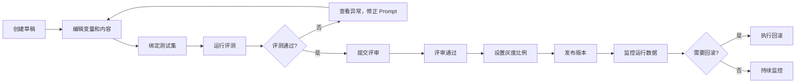

# Prompt 版本管理平台 PRD

## 1. 产品概述
Prompt 版本管理平台是一个面向产品、运营和算法人员的全栈 Web 系统，用于协同维护提示词、变量、测试集、评测结果和灰度发布流程。
- 核心目标：实现 Prompt 版本可回滚、变量可验证、效果可比较
- 目标用户：产品经理、运营人员、算法工程师、管理员

## 2. 核心功能

### 2.1 用户角色
| 角色 | 登录方式 | 核心权限 |
|------|---------|----------|
| 管理员 | 账号密码 | 全部权限、用户管理、系统配置 |
| 算法工程师 | 账号密码 | Prompt 编辑、评测运行、版本管理 |
| 产品/运营 | 账号密码 | 查看 Prompt、提交评审、查看监控数据 |
| 访客 | 无 | 只读浏览已发布版本 |

### 2.2 功能模块
1. **Prompt 草稿管理**：变量定义、示例输入、适用场景、风险说明、变更说明
2. **测试集与评测**：批量渲染变量、运行评测、异常列表管理
3. **版本发布**：评审流程、灰度比例、负责人管理、回滚入口
4. **监控面板**：调用量统计、失败率监控、低分反馈、人工投诉、版本对比
5. **用户权限**：角色管理、权限控制、操作审计

### 2.3 页面详情
| 页面名称 | 模块名称 | 功能描述 |
|---------|---------|----------|
| 登录页 | 用户认证 | 账号密码登录、权限验证 |
| 首页/仪表盘 | 概览模块 | 版本统计、快速入口、最近活动 |
| Prompt 列表页 | 草稿管理 | Prompt 列表、搜索筛选、新建草稿 |
| Prompt 详情页 | 草稿编辑 | 变量定义、示例输入、场景说明、变更记录 |
| 测试集管理页 | 测试管理 | 测试用例列表、导入导出、绑定 Prompt |
| 评测运行页 | 评测功能 | 批量评测、结果查看、异常列表 |
| 版本发布页 | 发布管理 | 评审流程、灰度配置、发布记录、回滚操作 |
| 监控面板 | 数据监控 | 调用量图表、失败率趋势、反馈投诉、版本对比 |
| 用户管理页 | 权限控制 | 用户列表、角色分配、操作日志 |

## 3. 核心流程

### Prompt 创作与发布流程

## 4. 用户界面设计

### 4.1 设计风格
- **主色调**：深蓝色 (#1e3a8a) 作为主色，代表专业和信任
- **辅助色**：青色 (#06b6d4) 用于交互元素，绿色 (#10b981) 表示成功，红色 (#ef4444) 表示警告/错误
- **中性色**：深灰 (#1f2937) 到浅灰 (#f3f4f6) 的渐变层次
- **按钮风格**：圆角 8px，悬停有轻微阴影和颜色加深
- **字体**：使用 Inter 字体家族，标题字重 600，正文 400
- **布局风格**：卡片式布局，左侧导航 + 顶部工具栏 + 内容区域
- **图标风格**：使用 Lucide 线性图标，保持简洁一致

### 4.2 页面设计概述
| 页面名称 | 模块名称 | UI 元素 |
|---------|---------|--------|
| Prompt 列表 | 列表区域 | 搜索框、筛选下拉、新建按钮、卡片列表、分页 |
| Prompt 详情 | 编辑区域 | 分栏布局，左侧表单编辑，右侧实时预览 |
| 评测页面 | 结果展示 | 表格展示结果，状态标签，异常筛选器 |
| 监控面板 | 数据图表 | 折线图、柱状图、数据卡片、告警提示 |

### 4.3 响应式设计
- 桌面端优先（1200px+）：完整功能展示
- 平板端（768px-1199px）：导航折叠，内容自适应
- 移动端（<768px）：底部导航，简化布局

## 5. 数据验证场景
1. **变量缺失验证**：创建含未定义变量的 Prompt，运行评测验证是否进入异常列表
2. **版本历史验证**：创建多个版本，验证历史记录和回滚功能
3. **灰度发布验证**：设置不同灰度比例，验证流量分配逻辑
4. **评测失败验证**：模拟超长输出、敏感内容，验证异常捕获
5. **权限控制验证**：不同角色访问受限功能，验证权限拦截
