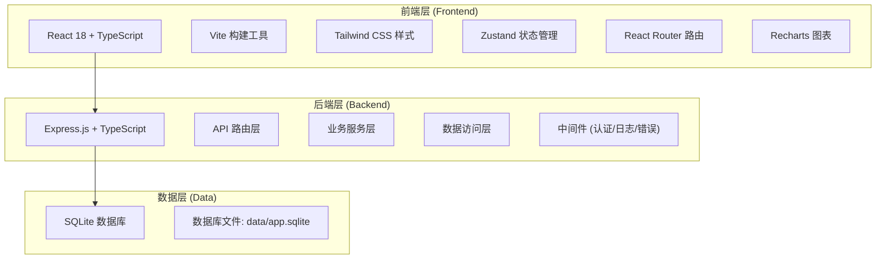
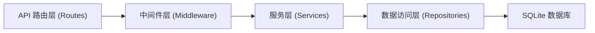
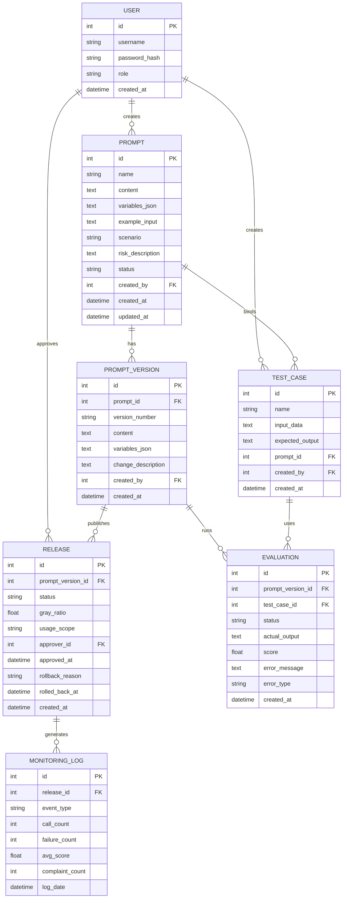

# Prompt 版本管理平台 技术架构

## 1. 架构设计


## 2. 技术选型说明
- **前端**: React@18 + TypeScript + Vite + TailwindCSS@3 + Zustand + React Router + Recharts + Lucide React
- **后端**: Express@4 + TypeScript + better-sqlite3
- **数据库**: SQLite (data/app.sqlite)
- **端口规划**: 前端 14350, 后端 24350 (基于项目号 HSv2-24350)

## 3. 路由定义

### 前端路由
| 路由路径 | 页面名称 | 说明 |
|---------|---------|------|
| /login | 登录页 | 用户认证 |
| /dashboard | 仪表盘 | 数据概览 |
| /prompts | Prompt 列表 | Prompt 草稿管理 |
| /prompts/:id | Prompt 详情 | 编辑 Prompt 草稿 |
| /test-cases | 测试集管理 | 测试用例管理 |
| /evaluations | 评测运行 | 评测执行与结果 |
| /releases | 版本发布 | 发布管理与回滚 |
| /monitoring | 监控面板 | 运行数据监控 |
| /users | 用户管理 | 权限控制 |

### 后端 API 路由
| 路由前缀 | 模块 | 说明 |
|---------|------|------|
| /api/auth | 认证 | 登录、登出、获取当前用户 |
| /api/prompts | Prompt | Prompt CRUD、变量管理 |
| /api/test-cases | 测试集 | 测试用例 CRUD、导入导出 |
| /api/evaluations | 评测 | 运行评测、获取结果、异常列表 |
| /api/releases | 版本发布 | 评审、发布、灰度、回滚 |
| /api/monitoring | 监控 | 统计数据、调用量、失败率 |
| /api/users | 用户 | 用户管理、角色权限 |

## 4. API 响应格式

### 统一响应结构
```typescript
interface ApiResponse<T = any> {
  success: boolean;
  data?: T;
  message?: string;
  error?: string;
}
```

### 分页响应
```typescript
interface PaginatedResponse<T> {
  items: T[];
  total: number;
  page: number;
  pageSize: number;
}
```

## 5. 后端架构分层


## 6. 数据模型

### 6.1 ER 图


### 6.2 数据库初始化 DDL
```sql
-- 用户表
CREATE TABLE IF NOT EXISTS users (
    id INTEGER PRIMARY KEY AUTOINCREMENT,
    username TEXT UNIQUE NOT NULL,
    password_hash TEXT NOT NULL,
    role TEXT NOT NULL DEFAULT 'viewer',
    created_at DATETIME DEFAULT CURRENT_TIMESTAMP
);

-- Prompt 表
CREATE TABLE IF NOT EXISTS prompts (
    id INTEGER PRIMARY KEY AUTOINCREMENT,
    name TEXT NOT NULL,
    content TEXT NOT NULL,
    variables_json TEXT,
    example_input TEXT,
    scenario TEXT,
    risk_description TEXT,
    status TEXT DEFAULT 'draft',
    created_by INTEGER NOT NULL,
    created_at DATETIME DEFAULT CURRENT_TIMESTAMP,
    updated_at DATETIME DEFAULT CURRENT_TIMESTAMP,
    FOREIGN KEY (created_by) REFERENCES users(id)
);

-- Prompt 版本表
CREATE TABLE IF NOT EXISTS prompt_versions (
    id INTEGER PRIMARY KEY AUTOINCREMENT,
    prompt_id INTEGER NOT NULL,
    version_number TEXT NOT NULL,
    content TEXT NOT NULL,
    variables_json TEXT,
    change_description TEXT,
    created_by INTEGER NOT NULL,
    created_at DATETIME DEFAULT CURRENT_TIMESTAMP,
    FOREIGN KEY (prompt_id) REFERENCES prompts(id),
    FOREIGN KEY (created_by) REFERENCES users(id)
);

-- 测试用例表
CREATE TABLE IF NOT EXISTS test_cases (
    id INTEGER PRIMARY KEY AUTOINCREMENT,
    name TEXT NOT NULL,
    input_data TEXT NOT NULL,
    expected_output TEXT,
    prompt_id INTEGER,
    created_by INTEGER NOT NULL,
    created_at DATETIME DEFAULT CURRENT_TIMESTAMP,
    FOREIGN KEY (prompt_id) REFERENCES prompts(id),
    FOREIGN KEY (created_by) REFERENCES users(id)
);

-- 评测结果表
CREATE TABLE IF NOT EXISTS evaluations (
    id INTEGER PRIMARY KEY AUTOINCREMENT,
    prompt_version_id INTEGER NOT NULL,
    test_case_id INTEGER NOT NULL,
    status TEXT DEFAULT 'pending',
    actual_output TEXT,
    score REAL,
    error_message TEXT,
    error_type TEXT,
    created_at DATETIME DEFAULT CURRENT_TIMESTAMP,
    FOREIGN KEY (prompt_version_id) REFERENCES prompt_versions(id),
    FOREIGN KEY (test_case_id) REFERENCES test_cases(id)
);

-- 发布表
CREATE TABLE IF NOT EXISTS releases (
    id INTEGER PRIMARY KEY AUTOINCREMENT,
    prompt_version_id INTEGER NOT NULL,
    status TEXT DEFAULT 'pending_review',
    gray_ratio REAL DEFAULT 0,
    usage_scope TEXT,
    approver_id INTEGER,
    approved_at DATETIME,
    rollback_reason TEXT,
    rolled_back_at DATETIME,
    created_at DATETIME DEFAULT CURRENT_TIMESTAMP,
    FOREIGN KEY (prompt_version_id) REFERENCES prompt_versions(id),
    FOREIGN KEY (approver_id) REFERENCES users(id)
);

-- 监控日志表
CREATE TABLE IF NOT EXISTS monitoring_logs (
    id INTEGER PRIMARY KEY AUTOINCREMENT,
    release_id INTEGER NOT NULL,
    event_type TEXT NOT NULL,
    call_count INTEGER DEFAULT 0,
    failure_count INTEGER DEFAULT 0,
    avg_score REAL,
    complaint_count INTEGER DEFAULT 0,
    log_date DATETIME DEFAULT CURRENT_TIMESTAMP,
    FOREIGN KEY (release_id) REFERENCES releases(id)
);

-- 初始用户数据
INSERT OR IGNORE INTO users (username, password_hash, role) VALUES
('admin', 'admin123', 'admin'),
('engineer', 'engineer123', 'engineer'),
('product', 'product123', 'product'),
('viewer', 'viewer123', 'viewer');
```

## 7. 目录结构

```
HSv2-24350/
├── .trae/documents/
│   ├── PRD.md
│   └── TECH_ARCH.md
├── src/                    # 前端源码
│   ├── components/         # 通用组件
│   ├── pages/             # 页面组件
│   ├── hooks/             # 自定义 hooks
│   ├── store/             # Zustand 状态管理
│   ├── utils/             # 工具函数
│   ├── types/             # TypeScript 类型定义
│   ├── App.tsx
│   └── main.tsx
├── api/                   # 后端源码
│   ├── src/
│   │   ├── routes/        # API 路由
│   │   ├── services/      # 业务服务
│   │   ├── repositories/  # 数据访问
│   │   ├── middleware/    # 中间件
│   │   ├── types/         # 类型定义
│   │   ├── db.ts          # 数据库连接
│   │   └── server.ts      # 服务器入口
│   └── data/              # SQLite 数据库文件
├── package.json
├── tsconfig.json
├── vite.config.ts
├── tailwind.config.js
├── postcss.config.js
└── .env                   # 环境变量
```
