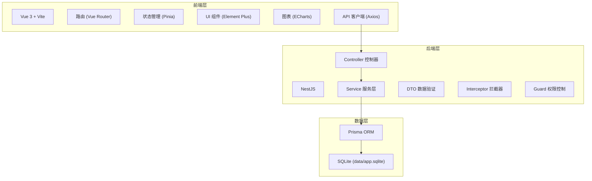

# AI 模型评测平台技术架构文档

## 1. 技术栈选型

### 1.1 前端技术栈
| 技术 | 选型 | 说明 |
|------|------|------|
| 框架 | Vue 3 | Composition API + Script Setup |
| 构建工具 | Vite 5 | 快速构建，热更新 |
| 路由 | Vue Router 4 | 单页应用路由 |
| 状态管理 | Pinia | Vue 官方推荐状态管理 |
| UI 组件库 | Element Plus | 企业级 UI 组件 |
| HTTP 客户端 | Axios | 统一请求封装 |
| 图表库 | ECharts 5 | 数据可视化图表 |
| 日期处理 | Day.js | 轻量日期处理库 |
| CSS 预处理器 | SCSS | 样式预处理 |

### 1.2 后端技术栈
| 技术 | 选型 | 说明 |
|------|------|------|
| 运行时 | Node.js 20+ | LTS 版本 |
| 框架 | NestJS 10 | 企业级 Node.js 框架 |
| 数据库 | SQLite | 文件数据库，无需额外服务 |
| ORM | Prisma 5 | 类型安全的数据库 ORM |
| 验证 | class-validator | DTO 参数校验 |

### 1.3 端口规划
- 后端端口：**24349（项目号本身，在 0-65535 范围内）
- 前端端口：**34349（包含后四位 4349）

## 2. 系统架构图



## 3. 数据库设计

### 3.1 核心表结构

#### 评测集相关表
- `evaluation_sets` - 评测集主表
- `evaluation_questions` - 评测题目表
- `evaluation_dimensions` - 评分维度表
- `evaluation_set_versions` - 评测集版本表

#### 模型任务相关表
- `model_tasks` - 模型任务主表
- `task_samples` - 任务样本运行记录表
- `model_versions` - 模型版本表
- `prompt_versions` - 提示词版本表

#### 评分复核相关表
- `sample_scores` - 样本评分表
- `manual_reviews` - 人工复核记录表
- `scoring_rules` - 评分规则表

#### 报告结论相关表
- `evaluation_reports` - 评测报告表
- `report_conclusions` - 报告结论表

#### 成本统计相关表
- `cost_statistics` - 成本统计表
- `token_consumptions` - Token 消耗明细表

## 4. 目录结构

### 4.1 前端目录结构
```
frontend/
├── src/
│   ├── api/              # API 接口封装
│   ├── assets/           # 静态资源
│   ├── components/     # 公共组件
│   ├── layouts/        # 布局组件
│   ├── router/         # 路由配置
│   ├── stores/         # Pinia 状态管理
│   ├── utils/          # 工具函数
│   ├── views/          # 页面组件
│   ├── App.vue
│   └── main.ts
├── .env
├── vite.config.ts
└── package.json
```

### 4.2 后端目录结构
```
backend/
├── src/
│   ├── common/         # 公共模块
│   ├── modules/       # 业务模块
│   │   ├── evaluation-sets/
│   │   ├── model-tasks/
│   │   ├── scoring/
│   │   ├── reports/
│   │   └── cost/
│   ├── prisma/        # Prisma schema
│   ├── app.module.ts
│   └── main.ts
├── prisma/
│   └── schema.prisma
├── data/              # SQLite 数据库文件
├── .env
└── package.json
```

## 5. 核心模块设计

### 5.1 统一响应格式
```typescript
interface ApiResponse<T> {
  success: boolean;
  data: T | null;
  message: string;
  code?: number;
}
```

### 5.2 API 客户端封装
- 10 秒超时
- 至少 1 次自动重试
- 请求/响应拦截器
- 统一错误处理（401、403、404、500）

### 5.3 前端状态管理
- 使用 Pinia 管理全局状态
- loading、error、empty、data 四类状态
- 模块化状态管理

## 6. 安全与防护

### 6.1 后端防护
- 所有 API 参数校验
- 数据库操作使用事务保护
- 关键写操作保证幂等性
- 异常日志记录

### 6.2 前端防护
- 全局错误边界
- 可选链和默认值兜底
- 按钮防重复提交
- 接口失败重试机制

## 7. 部署与启动

### 7.1 环境变量配置
- 后端 `.env` 文件配置端口、数据库路径
- 前端 `.env` 文件配置 API 地址、端口

### 7.2 启动命令
- 后端：`npm run start:prod
- 前端：`npm run dev

### 7.3 CORS 配置
- 后端配置 CORS 允许前端域名
- 前端配置代理

## 8. 验收验证要点

### 8.1 功能验收
1. 评测集 CRUD 操作正常
2. 模型任务创建、运行、重跑正常
3. 评分与人工复核正常
4. 报告生成与发布正常
5. 成本统计正常

### 8.2 异常验收
1. 接口失败不崩溃
2. 空数据页面正常显示
3. 重复提交防护生效
4. 数据库操作失败回滚
5. 任务中断可续跑
