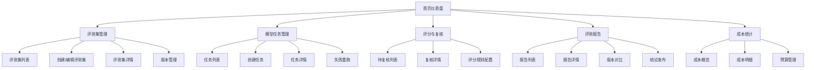

# AI 模型评测平台产品需求文档 (PRD)

## 1. 产品概述

### 1.1 产品定位
AI 模型评测平台是一个面向模型负责人、算法工程师、业务评审和财务管理人员的全栈业务系统，用于统一管理 AI 模型的评测流程，包括评测集管理、模型运行任务、评分复核、成本统计和结论发布。

### 1.2 目标用户
- **模型负责人**：管理评测集、发布模型结论、监控整体评测进度
- **算法工程师**：提交模型运行任务、查看评测结果、优化模型
- **业务评审**：进行人工复核、给出评分意见、审核模型质量
- **财务管理**：查看成本统计、控制 Token 消耗、预算管理

### 1.3 核心价值
- 统一评测流程，确保评测结果可追溯、可复查
- 自动化评分与人工复核相结合，提高评测准确性
- 实时成本监控，帮助控制模型运行成本
- 版本对比功能，清晰展示模型迭代效果

## 2. 功能需求

### 2.1 评测集管理模块

| 功能点 | 描述 | 优先级 |
|--------|------|--------|
| 题目管理 | 支持创建、编辑、删除评测题目，包含题干、输入数据 | P0 |
| 参考答案管理 | 为每个题目维护参考答案，支持多版本 | P0 |
| 评分维度配置 | 定义评分维度（如准确率、相关性、完整性等）及权重 | P0 |
| 业务场景标签 | 为评测集添加业务场景分类标签 | P1 |
| 难度分级 | 支持题目难度分级（简单、中等、困难） | P1 |
| 版本冻结 | 评测集版本发布后冻结，防止静默修改 | P0 |

### 2.2 模型任务管理模块

| 功能点 | 描述 | 优先级 |
|--------|------|--------|
| 任务创建 | 提交模型评测任务，选择模型、评测集 | P0 |
| 参数记录 | 记录模型版本、运行参数、提示词版本 | P0 |
| 并发控制 | 设置任务并发限制，防止资源过载 | P1 |
| 运行监控 | 实时显示任务状态、运行时间、进度 | P0 |
| 失败处理 | 记录失败原因，支持失败样本单独重跑 | P0 |
| 断点续跑 | 任务中断后可从断点继续执行 | P0 |

### 2.3 评分与复核模块

| 功能点 | 描述 | 优先级 |
|--------|------|--------|
| 规则评分 | 根据预设规则自动计算评分 | P0 |
| 人工复核 | 支持业务人员对评分结果进行人工复核 | P0 |
| 改分留痕 | 人工改分时必须填写理由并记录复核人 | P0 |
| 复核冲突处理 | 多人复核意见不一致时的冲突解决机制 | P1 |
| 评分规则变更 | 支持评分规则版本化，变更可追溯 | P0 |

### 2.4 报告与结论模块

| 功能点 | 描述 | 优先级 |
|--------|------|--------|
| 核心指标展示 | 准确率、稳定性、延迟、Token 成本 | P0 |
| 低分样本分析 | 展示低分样本详情，支持下钻分析 | P0 |
| 版本对比 | 多版本模型评测结果对比 | P0 |
| 结论发布 | 正式发布评测结论，发布后不可静默修改 | P0 |
| 报告导出 | 支持导出评测报告 | P1 |

### 2.5 成本统计模块

| 功能点 | 描述 | 优先级 |
|--------|------|--------|
| Token 消耗统计 | 按任务、模型、时间维度统计 Token 消耗 | P0 |
| 成本核算 | 根据 Token 单价计算实际成本 | P0 |
| 预算控制 | 设置预算阈值，超支预警 | P1 |
| 成本报表 | 多维度成本分析报表 | P1 |

## 3. 非功能需求

### 3.1 技术约束
- 统一实现为浏览器 Web 全栈业务系统
- 必须包含 Web 前端、后端 API、SQLite 数据库
- 所有核心动作都要落库并可复查
- 端口必须包含 24349 或后四位 4349

### 3.2 质量要求
- 防御性渲染：所有数据读取使用可选链和默认值兜底
- 异步状态机：loading、error、empty、data 四类状态
- 全域异常保护：全局错误边界，页面崩溃有兜底 UI
- 统一请求封装：10 秒超时、自动重试、统一错误处理
- 后端防护：参数校验、事务保护、幂等性保证
- 用户可恢复：防重复提交、成功/失败反馈、重试路径

## 4. 信息架构

## 5. 验收标准

### 5.1 核心流程验收
1. 创建评测集 → 添加题目 → 配置评分维度 → 冻结版本
2. 创建模型任务 → 运行任务 → 查看运行状态 → 失败重跑
3. 规则自动评分 → 人工复核 → 修改评分并留痕
4. 生成评测报告 → 查看核心指标 → 版本对比 → 发布结论
5. 查看成本统计 → Token 消耗分析 → 成本核算

### 5.2 异常场景验收
- 任务中断后断点续跑
- 评分规则变更后历史数据保留
- 多人复核冲突处理
- 空数据、接口失败、未登录场景不崩溃
- 重复提交防护生效
